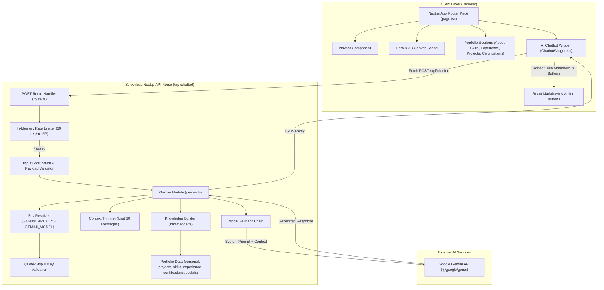
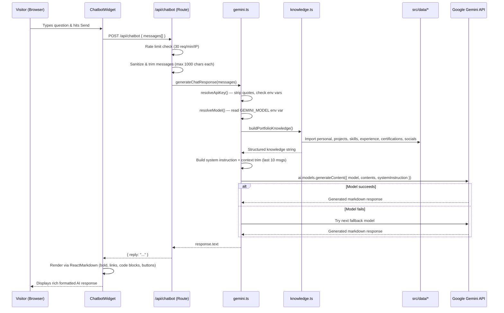

# Mohammad Warish Ansari — Portfolio & Gemini AI Assistant

A modern, high-performance, Dala-inspired personal portfolio web application for **Mohammad Warish Ansari** (Full-Stack & AI Engineer). Built with **Next.js 16 (App Router)**, **TypeScript**, **Tailwind CSS v4**, **Framer Motion**, and integrated with an interactive **AI Chatbot** powered by **Google Gemini API** (`@google/genai`).

---

## 🌟 Architecture & Data Flow Diagram



### Chatbot Internal Pipeline



---

## 🚀 Key Features

- **Dala Design System**: "Particle cosmos on a void" aesthetics with pure black background (`#000000`), violet authority color (`#8052ff`), glowing typography, and subtle micro-animations.
- **Interactive AI Chatbot**:
  - Powered by **Google Gemini API** (`@google/genai` v2.26.0) with configurable model via `GEMINI_MODEL` env var.
  - Smart model fallback chain: tries primary model first, then stable fallbacks (`gemini-2.5-flash`, `gemini-3.5-flash-lite`, `gemini-2.5-flash-lite`).
  - Robust API key handling with automatic quote-stripping and multi-env-var resolution.
  - Contextual awareness built from a structured knowledge base covering bio, skills, experience, projects, and credentials — imported directly from the portfolio's `src/data/` modules.
  - Rich markdown support (**bold**, *italics*, inline code, code block with copy button, blockquotes, ordered/unordered lists).
  - **Interactive Action Buttons**: Auto-renders markdown links (e.g. `[Explore Projects](#projects)`) as interactive buttons that smoothly scroll to portfolio sections or open external credentials.
  - Serverless API route with IP-based rate limiting (30 req/min) and robust error fallbacks.
  - Demo Mode: gracefully guides visitors through portfolio sections when no API key is configured.
- **Full-Stack & Applied AI Showcase**:
  - Filterable skill matrix with animated proficiency bars.
  - Interactive project cards with 3D tilt effects, tech tag chips, and repository links.
  - Verified credentials modal for Oracle Cloud Infrastructure, Agentic AI, DevOps, Microsoft, Docker, and GitHub certifications.
- **Performance & SEO**:
  - Next.js 16 Turbopack build system with static page pre-rendering.
  - Comprehensive OpenGraph and Twitter card metadata.

---

## 🛠️ Tech Stack

| Category | Technologies |
| :--- | :--- |
| **Framework & Language** | Next.js 16 (App Router), React 19, TypeScript 5 |
| **AI Integration** | Google Gemini API (`@google/genai`), Configurable Model, RAG-style Prompt Engineering |
| **Styling & Design System** | Tailwind CSS v4, Custom CSS Tokens, Lucide Icons, React Icons |
| **Animations & Smooth Scroll** | Framer Motion, Lenis Smooth Scroll, Three.js / React Three Fiber |
| **Markdown & Rich UI** | React Markdown, Remark GFM, Custom Code Blocks |
| **Deployment & Hosting** | Vercel, Node.js Serverless Functions |

---

## 🔧 Environment Variables & Vercel Setup

To activate live AI responses via Google Gemini, set the environment variables in your `.env` file or in **Vercel Project Settings → Environment Variables**:

```env
# Google Gemini API Key (server-side ONLY — never exposed to the client)
# Generate at: https://aistudio.google.com/app/apikey
# IMPORTANT: Do NOT wrap the value in quotes!
GEMINI_API_KEY=your_google_gemini_api_key_here

# Gemini model to use (optional, default: gemini-2.5-flash)
# Verified available: gemini-3.8-flash, gemini-3.5-flash-lite, gemini-2.5-flash, gemini-2.5-flash-lite
GEMINI_MODEL=gemini-2.5-flash
```

> **⚠️ Common Pitfall**: If you wrap your API key in quotes (e.g. `GEMINI_API_KEY="AIza..."`) the quotes become part of the value and the key will be rejected as invalid. The code handles this automatically, but it's best to avoid quotes entirely.

> **Note**: If `GEMINI_API_KEY` is omitted, the chatbot gracefully switches to a helpful interactive Demo Mode guiding visitors through portfolio sections.

---

## 📁 Project Structure

```
Portfolio/
├── src/
│   ├── app/
│   │   ├── page.tsx                    # Main portfolio page
│   │   ├── layout.tsx                  # Root layout with metadata
│   │   └── api/chatbot/route.ts        # Gemini chatbot API route
│   ├── components/
│   │   ├── chatbot/ChatbotWidget.tsx    # AI chatbot floating widget
│   │   ├── sections/                   # Portfolio section components
│   │   └── ui/                         # Reusable UI components
│   ├── data/                           # Portfolio data (personal, projects, skills, etc.)
│   ├── lib/chatbot/
│   │   ├── gemini.ts                   # Gemini API integration & model fallback
│   │   └── knowledge.ts               # Knowledge base builder from portfolio data
│   └── types/                          # TypeScript type definitions
├── public/                             # Static assets
├── .env.example                        # Environment variable template
├── next.config.ts                      # Next.js configuration
├── tailwind.config.ts                  # Tailwind CSS configuration
├── tsconfig.json                       # TypeScript configuration
└── vercel.json                         # Vercel deployment configuration
```

---

## 🏃 Local Development

1. **Clone the repository**:
   ```bash
   git clone https://github.com/mdwarishansari/Portfolio.git
   cd Portfolio
   ```

2. **Install dependencies**:
   ```bash
   npm install
   ```

3. **Configure environment**:
   ```bash
   cp .env.example .env
   # Edit .env and add your GEMINI_API_KEY
   ```

4. **Run development server**:
   ```bash
   npm run dev
   ```
   Open [http://localhost:3000](http://localhost:3000) in your browser.

5. **Production Build & Typecheck**:
   ```bash
   npm run build
   ```

---

## 📜 Repository Scripts

- `npm run dev` — Starts Next.js development server with Turbopack.
- `npm run build` — Compiles optimized production build.
- `npm run start` — Runs Next.js production server.
- `npm run typecheck` — Executes TypeScript type checking.
- `npm run lint` — Runs ESLint code quality checks.

---

## 👤 Author & Contact

**Mohammad Warish Ansari** — Full-Stack & AI Engineer
- **Email**: [warishansari.official@gmail.com](mailto:warishansari.official@gmail.com)
- **LinkedIn**: [linkedin.com/in/mdwarishansari](https://linkedin.com/in/mdwarishansari)
- **GitHub**: [github.com/mdwarishansari](https://github.com/mdwarishansari)
